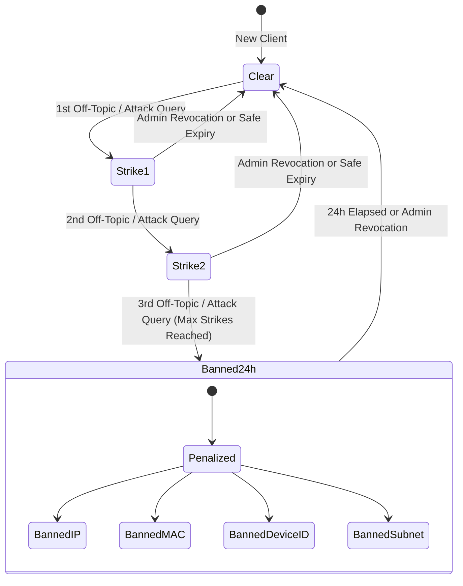
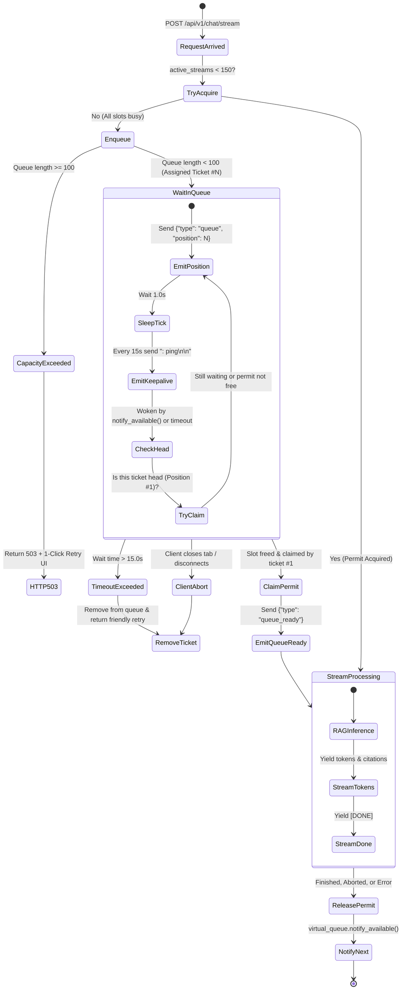

# Backend Architecture & Real-Time Streaming Specification

Authoritative technical documentation for the backend architecture of **CanIGraduateUD-RAG**, detailing the request lifecycle, Server-Sent Events (SSE) streaming protocol, zero-token security guardrails, virtual queue state machine, and LLM resilience engine.

---

## 1. System Architecture Overview

CanIGraduateUD-RAG is a high-concurrency normative RAG service built on **FastAPI 0.111+** and **Python 3.11**, designed to serve students of Universidad Distrital Francisco José de Caldas with zero-hallucination answers regarding degree options, curricular requirements, and institutional regulations.

```mermaid
flowchart TD
    subgraph ClientLayer ["Client Layer (Next.js 14 App Router)"]
        UI[ChatInterface.tsx]
        SSEClient[Resilient SSE Client: api.ts]
        UI --> SSEClient
    end

    subgraph FastAPIRouter ["FastAPI Ingestion & Routing (app/api/v1/chat.py)"]
        Endpoint["POST /api/v1/chat/stream"]
        SSEClient -->|Headers: X-Device-Id, X-MAC-Address| Endpoint
    end

    subgraph SecurityGates ["Zero-Token Pre-Flight Security Gates (0 Tokens Consumed)"]
        G1{"Gate 1: Active 24h Ban?\n(IP, MAC, Subnet, Device ID)"}
        G2{"Gate 2: Rate Limiter?\n(Max 10 req/min sliding window)"}
        G3{"Gate 3: Prompt Attack / Abuse?\n(Regex injection & offtopic)"}
        G4{"Gate 4: Benign Greeting?\n('hola', 'quién eres')"}
        G5{"Gate 5: Hybrid Query Cache?\n(L1 Exact SHA-256 / L2 Cosine >= 0.95)"}

        Endpoint --> G1
        G1 -->|Banned| Resp403["HTTP 403 SSE: Ban Notification"]
        G1 -->|Clear| G2
        G2 -->|Exceeded| Resp429["HTTP 429 SSE: Retry After N s"]
        G2 -->|Clear| G3
        G3 -->|Violation| StrikeLog["Record Strike (1-3)\n3 Strikes = 24h Ban"]
        G3 -->|Safe| G4
        G4 -->|Greeting Match| RespGreeting["HTTP 200 SSE: Direct Orientation"]
        G4 -->|Academic Query| G5
        G5 -->|Cache Hit| StreamCache["HTTP 200 SSE: Stream Cached Tokens"]
    end

    subgraph ConcurrencyAndQueue ["Concurrency Control & Virtual Queue (app/core/)"]
        G5 -->|Cache Miss| CheckSlots{"STREAM_CONCURRENCY_SEMAPHORE\nActive Slots < 150?"}
        CheckSlots -->|Slot Available| AcquirePermit["Acquire Permit\n(SemaphoreReleaseGuard)"]
        CheckSlots -->|All 150 Busy| EnterQueue["virtual_queue.enqueue()\n(Capacity: 100, Timeout: 15s)"]
        EnterQueue -->|Queue Full (>=100)| Resp503["HTTP 503: Busy (1-Click Retry)"]
        EnterQueue -->|Enqueued| WaitLoop["Wait Loop + Keepalive\n(': ping' every 15s)"]
        WaitLoop -->|Permit Released| ClaimHead["try_claim_permit()\nHead Ticket Position #1 Claims Slot"]
        ClaimHead --> AcquirePermit
    end

    subgraph RAGPipeline ["RAG Inference Pipeline (app/services/)"]
        AcquirePermit --> RAGService["rag_service.answer_stream()"]
        RAGService --> VectorSearch["ChromaDB Vector Retrieval\n('ud_sistemas_regulations')"]
        VectorSearch --> DerogationCheck["Derogation & Validity Filter\n(Omit superseded articles)"]
        DerogationCheck --> PromptAssembly["System Prompt & Context Assembly"]
        PromptAssembly --> OpenRouterResilience["OpenRouter Resilience Engine\n(Primary: Llama 3.1 8B\nFallbacks: Llama 3.3 70B, Gemini 2.0 Flash)"]
    end

    subgraph OutputAndPostProcessing ["Output & Post-Processing"]
        OpenRouterResilience --> SSEOutput["SSE Event Stream\n(token, citations, [DONE])"]
        SSEOutput --> SSEClient
        SSEOutput -.->|Release Permit| SemaphoreReleaseGuard["Release Semaphore\nNotify Virtual Queue"]
        SemaphoreReleaseGuard -.->|Cascade Wakeup| ClaimHead
        SSEOutput -.->|Async Write| AsyncCacheWrite["Background ThreadPool:\nredis_cache.set()"]
        SSEOutput -.->|Log Query| DBLogging["PostgreSQL Session:\nStudentQueryLog"]
    end
```

---

## 2. Server-Sent Events (SSE) Streaming Protocol

The primary interface between frontend clients and backend inference is the SSE streaming endpoint:
- **Endpoint**: `POST /api/v1/chat/stream`
- **Content-Type**: `application/json`
- **Response Format**: `text/event-stream`
- **Cache-Control**: `no-cache`
- **Connection**: `keep-alive`

### 2.1 Wire Event Specifications

Each SSE chunk follows standard `data: <json>\n\n` or comment `: <text>\n\n` wire encoding:

#### 1. `queue` Event (Virtual Queue Position)
Emitted immediately when all 150 active concurrency slots are occupied and the student enters the waiting queue.
```
data: {"type": "queue", "position": 2, "estimated_seconds": 4}

```

#### 2. `queue_ready` Event (Queue Exit)
Emitted when the head ticket claims a freed concurrency permit and transitions to RAG inference.
```
data: {"type": "queue_ready"}

```

#### 3. `token` Event (Incremental Generation)
Emitted for every generated token or punctuation chunk from the LLM adapter or cached response.
```
data: {"type": "token", "content": "De acuerdo con el "}

```

#### 4. `citations` Event (Normative References)
Emitted prior to stream completion with structured metadata of official university documents cited in the answer.
```
data: {"type": "citations", "citations": [{"document_id": 1, "title": "Acuerdo 038 de 2015", "article": "Artículo 3", "source_type": "SEED", "url": "/documents/acuerdo-038-2015.pdf"}]}

```

#### 5. `: ping` Comment (Proxy & Edge Keepalive)
Emitted every 15.0 seconds (`SSE_KEEPALIVE_INTERVAL_SECONDS`) to prevent intermediate HTTP reverse proxies (Cloudflare, Vercel Edge, Nginx) from dropping idle streaming sockets while waiting in the queue or awaiting the first token.
```
: ping

```
*Note: Ignored by frontend JSON parsers according to the W3C SSE standard.*

#### 6. `[DONE]` Signal (Stream Terminal)
Indicates that generation and citation delivery are complete.
```
data: [DONE]

```

### 2.2 Concurrency Saturation & HTTP 503 Protocol

When the system experiences massive student surges:
1. If the virtual queue reaches capacity (`len(queue) >= 100`), incoming requests receive **HTTP 503 Service Unavailable** with header `Retry-After: 5` and a user-friendly payload.
2. If a queued request exceeds the maximum wait duration (`QUEUE_MAX_WAIT_SECONDS = 15.0s`), the ticket is cancelled and a polite retry prompt is streamed followed by `[DONE]`.
3. The frontend client catches HTTP 503 and presents a prominent **1-click retry button**, allowing the student to re-request immediately without re-typing their question.

### 2.3 Connection Disconnect & Permissive Resource Cleanup

To prevent permit leaks on client disconnects, network drops, or browser tab closures:
- **`SemaphoreReleaseGuard`**: Implements thread-safe reference counting. Invoked upon:
  * Normal stream completion (`[DONE]`).
  * Generator termination (`GeneratorExit` raised when the client disconnects).
  * Unhandled stream exceptions.
  * Python garbage collection (`__del__`).
- **Cascade Wakeup**: Every permit release calls `virtual_queue.notify_available()`, triggering `ready_event.set()` on the head waiting ticket.
- **`QueueTicketGuard`**: Ensures abandoned tickets are removed from the queue and tickets ahead update their positions.

---

## 3. Zero-Token Security Guardrails Pipeline

CanIGraduateUD-RAG implements a **0-token pre-flight architecture** where abusive, malicious, or non-academic requests are filtered out before querying vector stores or LLM endpoints, protecting institutional API budgets and preventing token exhaustion attacks.

### 3.1 Multi-Factor Client Identification
Clients are tracked across four orthogonal vectors to prevent network hop evasions:
- **Client IP**: Extracted taking into account `CF-Connecting-IP`, `X-Real-IP`, `X-Forwarded-For`, and socket host.
- **Network Subnet**: Calculated automatically as `/24` for IPv4 or `/64` for IPv6 to prevent subnet-rotation evasion.
- **Hardware MAC / Fingerprint**: Passed in `X-MAC-Address` or `X-Client-MAC` headers.
- **Device ID**: Persistent client-generated UUID stored in browser storage and passed in `X-Device-Id`.

### 3.2 Gate Walkthrough

| Gate | Target / Mechanism | Action on Match | Status / Response |
|---|---|---|---|
| **Gate 1: 24-Hour Active Ban** | Checked against `strike_manager` in-memory records and `SecurityPenaltyLog` in PostgreSQL. | Blocks banned clients immediately. | HTTP 403 Forbidden SSE stream with exact hours/minutes remaining and reason. |
| **Gate 2: Volumetric Rate Limiter** | Sliding window tracking timestamps per client (`10 requests / 60 seconds`). | Throttles excessive query volume. | HTTP 429 Too Many Requests SSE stream with `Retry-After` header. |
| **Gate 3: Cyberattack & Abuse Gate** | High-performance regex patterns for prompt injection, jailbreaks (DAN), base64 payloads, and non-academic off-topic requests. | Records strike against client. 3 strikes trigger immediate 24h ban. | Strike warning (Strikes 1-2: HTTP 200 SSE; Strike 3: HTTP 403 SSE 24h ban). |
| **Gate 4: Benign Greeting Gate** | Regex matching Spanish greetings ("hola", "buenos días", "quién eres", "para qué sirves"). | Returns comprehensive degree assistant orientation message. | HTTP 200 OK SSE stream (0 LLM tokens consumed). |
| **Gate 5: Hybrid Cache Check** | Exact SHA-256 hash match (Layer 1) and cosine similarity >= 0.95 (Layer 2). | Streams cached answer and verified citations immediately. | HTTP 200 OK SSE stream with header `X-Cache-Hit: true`. |

### 3.3 Prompt Injection & Abuse Regex Specifications

1. **Prompt Injections & Instruction Overrides**:
   - `(?i)\b(?:ignore|ignora|desestima|olvida|bypass|salta|descarta)\b.*?\b(?:previous|anteriores|instructions|instrucciones|reglas|rules)\b`
   - `(?i)\b(?:system\s*prompt|instrucciones\s*secretas|developer\s*mode|jailbreak|dan\s*mode)\b`
   - Delimiters: `<|im_start|>`, `<|im_end|>`, `[SYSTEM]`, `[INST]`, `### System`
2. **Non-Academic / Off-Topic Inquiries**:
   - Stories & Poems: `cuéntame un cuento`, `escribe una historia`, `adivinanza`
   - Arbitrary Languages: `háblame en chino`, `responde en ruso/japonés/alemán`
   - Romance & Personal: `necesito novia`, `quieres ser mi novia`, `dame un beso`
   - Recipes & Cooking: `receta de pizza`, `cómo preparar arroz/pasta/sushi`
   - Sports & Betting: `resultado del partido`, `champions league`, `baloto/lotería`
   - Malware: `crear un virus`, `script para hackear`, `inyección sql para vulnerar`

### 3.4 The 3-Strikes Penalty Lifecycle



- **Strike 1**: Friendly educational warning detailing platform scope.
- **Strike 2**: Critical warning stating that 1 more violation results in 24h ban.
- **Strike 3**: 24-hour total ban applied across IP, Subnet (`/24`), MAC address, and Device ID. Persisted to PostgreSQL `SecurityPenaltyLog`.

---

## 4. Virtual Queue State Machine

The `VirtualQueueManager` controls concurrency bursts when student traffic exceeds the 150-permit semaphore limit.



### Key Concurrency Invariants
- **FIFO Strict Ordering**: Permits can only be claimed by ticket index 0 (`self._queue[0] is ticket`). Other waiters sleep on their private `threading.Event()`.
- **Zero Race Conditions**: `try_claim_permit` evaluates position and acquires the semaphore inside `virtual_queue.lock`.
- **Sub-Millisecond Cascade Wakeup**: As soon as a stream finishes, `guard.release()` wakes the head waiter instantly without polling delays.

---

## 5. OpenRouter Resilience Engine

The LLM interface (`app/services/llm_adapter.py`) connects to OpenRouter via an OpenAI-compatible interface with multi-model redundancy and backoff.

### 5.1 Multi-Model Fallback Hierarchy
1. **Primary Model**: `meta-llama/llama-3.1-8b-instruct` (high-speed, low latency, normative reasoning).
2. **Secondary Fallback**: `meta-llama/llama-3.3-70b-instruct` (deep reasoning, high accuracy).
3. **Tertiary Fallback**: `google/gemini-2.0-flash-001` (high throughput, large context window).

The fallback array is submitted directly in OpenRouter's native routing header:
```python
extra_kwargs["extra_body"] = {
    "models": [
        "meta-llama/llama-3.1-8b-instruct",
        "meta-llama/llama-3.3-70b-instruct",
        "google/gemini-2.0-flash-001"
    ]
}
```

### 5.2 Exponential Backoff & Transient Error Classification
The adapter retries up to `OPENROUTER_MAX_RETRIES = 3` times with delay calculated as:
$$\text{Delay} = \text{backoff\_factor}^{\text{attempt}} = 1.5^{\text{attempt}}$$

- **Transient (Retryable)**:
  * HTTP 429 (Rate Limit / Quota Exceeded)
  * HTTP 500, 502, 503, 504 (Server Overload / Bad Gateway)
  * HTTP 520–530 (Cloudflare Edge Errors)
  * Connection resets, network timeouts (`httpx.TimeoutException`, `httpx.NetworkError`)
- **Permanent (Never Retried)**:
  * HTTP 400 (Bad Request), 401 (Unauthorized / Invalid API Key), 403 (Forbidden), 404 (Not Found), 422 (Unprocessable Entity).

### 5.3 Repetition Loop Detection Heuristic
To prevent degenerative LLM repetition traps:
- If generated text length exceeds 140 characters, `_is_repetition_loop` analyzes:
  1. Sentences of $\ge 25$ characters appearing $\ge 3$ times.
  2. The recent tail ($\ge 35$ characters) repeating $\ge 3$ times in the generated response.
  3. Cyclical identical segments of length $\ge 35$ characters occurring consecutively.
- When detected, the stream is gracefully terminated, logging a warning and preserving valid prior tokens without corrupting client output.
